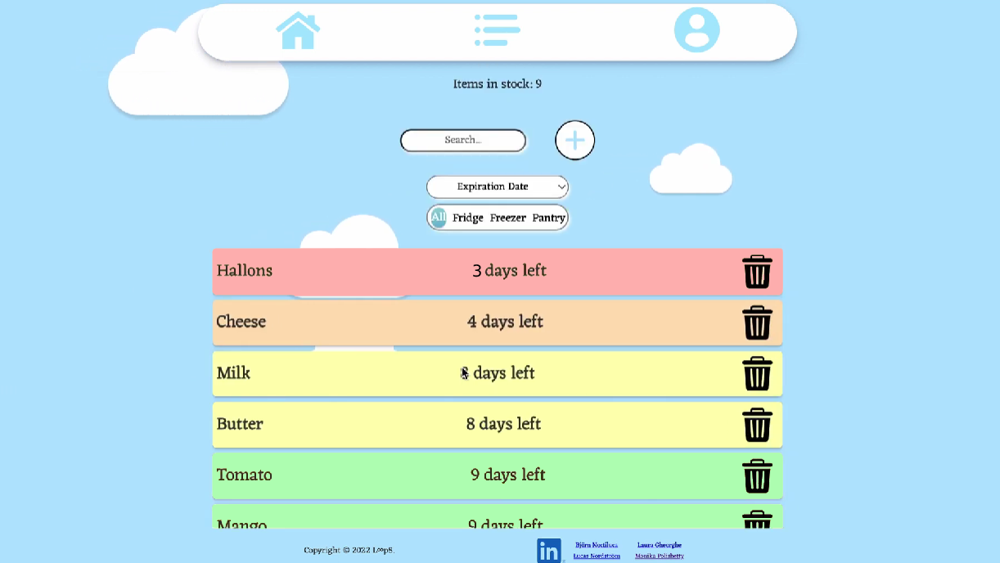

# Loop5FinalProject

Are you like the rest of us, buy groceries without a care in the world only to find some unspeakable mold in an abandoned corner of your refrigirator? 
Well worry no longer, because Twerp is here to assist in keeping your kitchen perish-free!

Use this app to keep track of all your perishables stored in the kitchen. Login or create an account to store your products information within our databse, having the option to save an unlimited amount of items - as many as you can fit in your kitchen. 

Choose between three possible locations: Refrigirator, Freezer or Pantry, set a quantity value for each as well as their expiration date. 

Display the list of your items in any order you choose from: Alphabetically, by amount, by location or by expiration date. Every item has a set color dependant on the days left until it expires: green for over 9 days, yellow for 9 days and under, orange for 6 days and under, red for 3 days and under, and finally dark purple to let you know it has left the world of the "recommended to eat" - but we won't make that choice for you :) !
There is even a search as you type feature to help you find your produce in no time.

Once an item has been consumed or discarded, you can remove it by clicking the trashcan button. Did you perhaps notice a typo or maybe want to update the quantity of a specific product? No problem! Our app allows you to edit any of the items in your list. As an extra added feature, we can give you a random recipe suggestion based off that ingredient. Who knows, maybe you'll get inspired to make something yummy.

